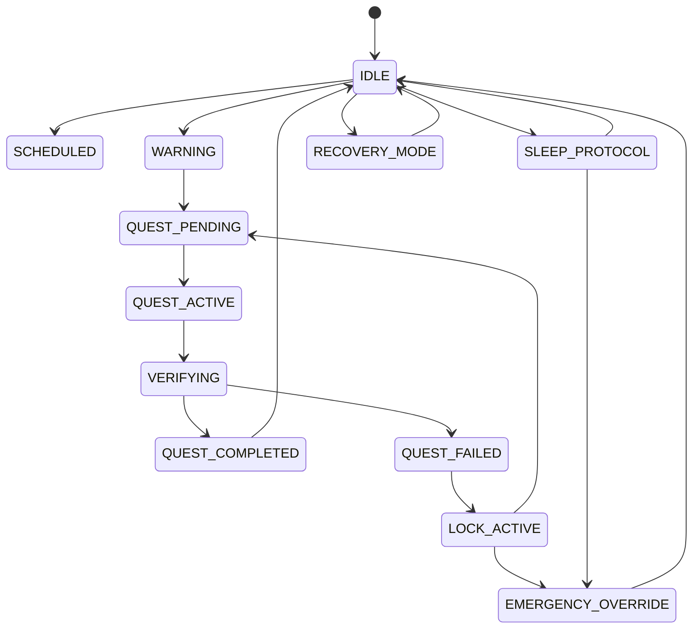

# Persistent state machine

```mermaid
stateDiagram-v2
  [*] --> IDLE
  IDLE --> SCHEDULED
  IDLE --> WARNING
  WARNING --> QUEST_PENDING
  QUEST_PENDING --> QUEST_ACTIVE
  QUEST_ACTIVE --> VERIFYING
  VERIFYING --> QUEST_COMPLETED
  VERIFYING --> QUEST_FAILED
  QUEST_COMPLETED --> IDLE
  QUEST_FAILED --> LOCK_ACTIVE
  LOCK_ACTIVE --> QUEST_PENDING
  LOCK_ACTIVE --> EMERGENCY_OVERRIDE
  EMERGENCY_OVERRIDE --> IDLE
  IDLE --> SLEEP_PROTOCOL
  SLEEP_PROTOCOL --> EMERGENCY_OVERRIDE
  SLEEP_PROTOCOL --> IDLE
  IDLE --> RECOVERY_MODE
  RECOVERY_MODE --> IDLE
```

Every accepted transition is written to `system_state`; invalid transitions fail closed without a device action.
